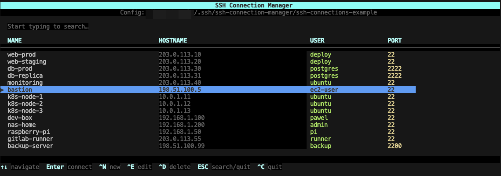

# SSH Connection Manager

Interactive TUI for managing SSH connections.



## Usage

```bash
node ssh-manager.js
```

### Direct connect

```bash
./ssh-manager.js my-server
```

Connects immediately without opening the TUI.

## Keyboard shortcuts

| Key | Action |
|-----|--------|
| `↑` / `↓` | Navigate the list |
| `Enter` | Connect |
| `Ctrl+N` | Add new connection |
| `Ctrl+E` | Edit selected |
| `Ctrl+D` | Delete selected |
| `ESC` | Clear search / quit |
| `Ctrl+C` | Quit |
| Any character | Live search |

## Search

Start typing — the list filters in real time by name, hostname, and user. `ESC` clears the search.

## Config file

Connections are stored in `ssh-connections-config` using the standard `~/.ssh/config` format:

```
Host my-server
  HostName 192.168.1.10
  User pawel
  Port 22
  IdentityFile ~/.ssh/id_rsa
```

The file is fully compatible with plain SSH:

```bash
ssh -F ~/.ssh/ssh-connection-manager/ssh-connections-config my-server
```

## Configuration

The app reads `.ssh-manager.json` from its own directory on startup:

```json
{
  "connectionsFile": "ssh-connections-config"
}
```

The `connectionsFile` value can be:

| Format | Example | Resolved as |
|--------|---------|-------------|
| Relative path | `"ssh-connections-config"` | relative to the script directory |
| Home-relative | `"~/my-ssh/connections"` | expanded from `$HOME` |
| Absolute path | `"/etc/ssh/my-connections"` | used as-is |

## Shell alias

Add an alias to your `.zshrc` or `.bashrc` so you can run the manager from anywhere:

```bash
# ~/.zshrc or ~/.bashrc

# Open TUI
alias sshm="/path/to/ssh-manager.js"

# Direct connect: sshm my-server
alias sshm="/path/to/ssh-manager.js"
```

Then reload your shell:

```bash
source ~/.zshrc   # or source ~/.bashrc
```

Usage after alias:

```bash
sshm              # open TUI
sshm my-server    # connect directly
```

## Requirements

Node.js
